# 小程序调研

## 企业展示微信小程序
### 微盛企业展示小程序功能
* __增加企业品牌效应__
    __`企业文化`__, __`工作环境`__, __`历史发展`__, __`员工风采`__

* __增加客户对企业的认知度__
    __`产品介绍`__, __`公司案例`__, __`新闻动态`__

* __助力企业推广__
    __`一件分享`__, __`附近搜索`__, __`精准搜索`__

* __增加企业和客户的互动__
    __`一键拨号`__, __`一键导航`__, __`LBS定位`__

* __手机端管理__
    __`一键登录`__, __`维护内容`__, __`管理用户`__, __`管理留言`__

* __全网覆盖,多端数据同步__

### 企业展示小程序功能总结
__企业展示项目的核心 `企业信息展示`, `企业和潜在客户的交互`__

* __企业信息展示__
    - 常规信息介绍, 比如公司 __基本信息__,__联系方式__,__地址__,__地图__,这些可以放在 __`关于我们`__ 一栏
    - 核心信息展示, 这个主要是产品,或者案例的展示. 这个放在 __`首页`__, 是小程序显示的核心,也是主要篇幅的内容
* __和用户互动__
    - 此功能主要方便潜在客户联系公司 __`一键拨号`__, __`一键导航`__, 以及和公司的互动 __`留言`__. __`留言`__ 功能也可以做到用户与用户沟通.
* __手机端管理__
    - 内容管理, 主要负责更新小程序上面的文字,图片,链接 等等信息.
    - 用户管理, 主要负责用户账号,权限,日志等等信息的收集和管理.
    - 留言管理, 主要是查看留言,删除,收集留言等等.
---

## 电商微信小程序

### 微盛电商小程序功能
#### 电商商家管理
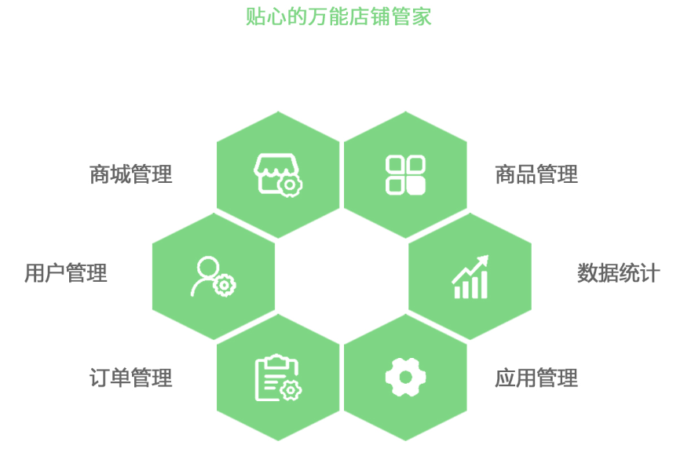
---
#### 电商营销活动
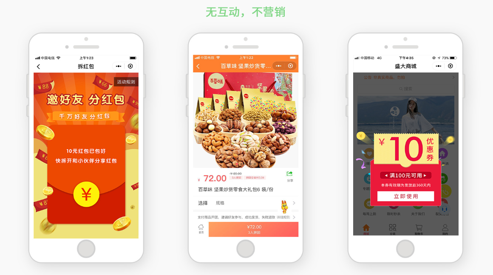
---
#### 电商内容管理
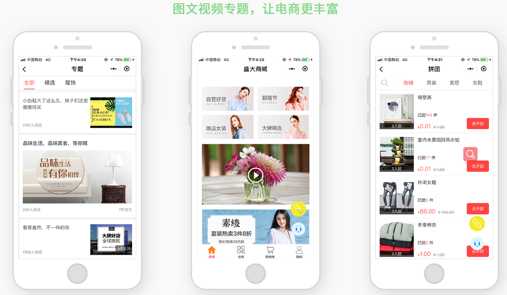
---
#### 电商后台管理
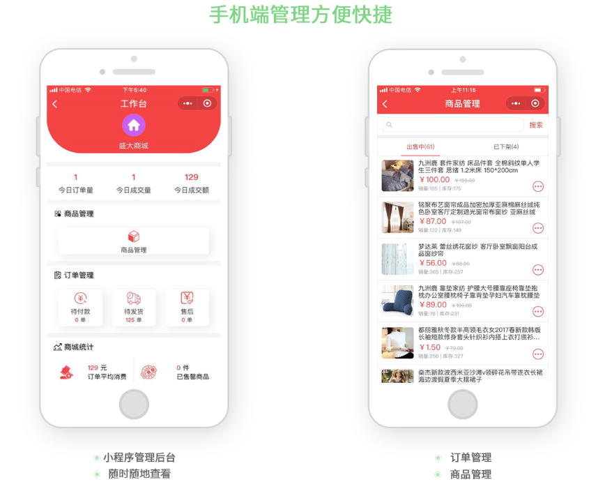
---

### 电商小程序功能总结梳理
电商系统可以做的非常复杂,类似京东,淘宝这样的系统.可是我们的客户的需求,资金肯定不需要这样的系统.我们如果做电商小程序,应该试着从最基本的功能模块做起来,这样可以减小风险,加快研发速度.

#### 购物基本流程
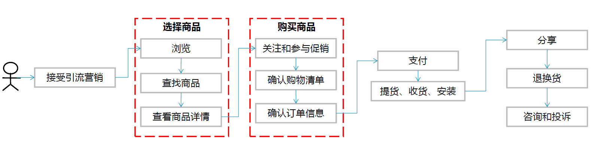
---
我们可以讲整个过程分为三个核心功能和几个辅助功能

* __核心. 商品选择__ 这是用户入口,供用户选择,了解商品
    - 搜索,商品展示(包含了商品的基本信息,有货无货,商品详情等等)
* __核心. 购买商品__ 这是交易过程,支撑交易的需要
    - 购物车管理,订单管理,店铺活动管理,价格管理
* __核心. 用户管理__
    - 用户基本信息管理,权限管理,用户画像等等
* __非核心. 支付__
    - 支付可以利用支付宝或者微信支付
* __非核心. 服务系统__
    - 主要是在线聊天功能的客服系统, 售后退换货管理,评价管理
* __智能分析__
    - 基于用户行为,用户画像等等信息,给用户做智能推荐(这个粗精度的实现不难,却可以成为我们的亮点)
* __企业基本信息__

---

## 餐饮微信小程序
### 微盛餐饮小程序功能介绍
#### 餐饮功能
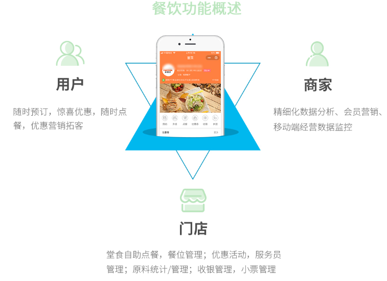
---
#### 商家管理功能
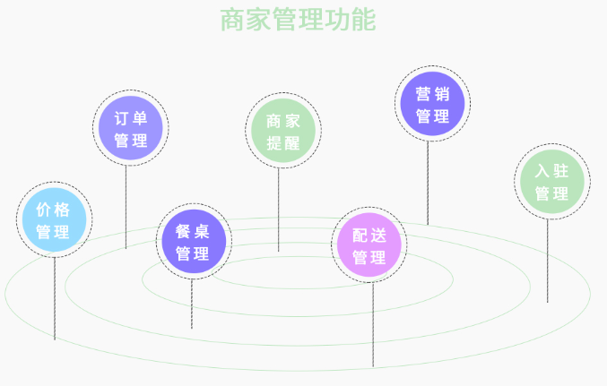
---
#### 移动端管理功能
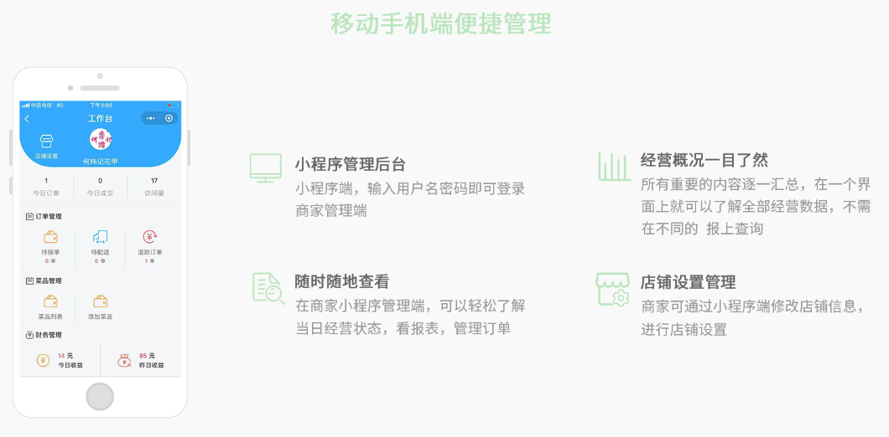
---
### 餐饮小程序的功能总结
#### 餐饮总体设计
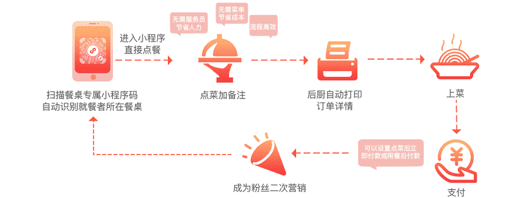
---
#### 餐饮的消费逻辑
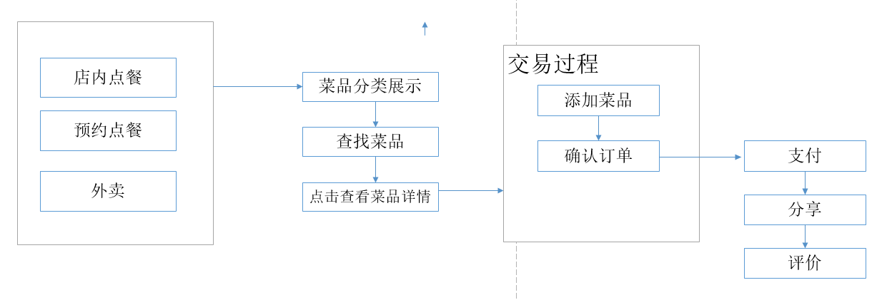
---
__餐饮小程序主要功能__

* __客户入口__ 这个模块是客户的消费入口
    - 包括 点餐, 预约点餐, 外卖
* __菜品展示__ 这个模块是菜品展示相关的数据
    - 菜品简介,菜品详情,菜品分类,菜品搜索
* __消费__ 这个是点菜到支付的过程
    - 生成订单,结算(支付宝或者微信接口)
* __服务模块__ 
    - 留言,评价,联系,预约排队
* __管理模块__ 这个模块是店家对小程序数据的管理
    - 菜品信息管理,用户信息管理,数据统计

---

## 小程序管理
### 内容管理
__内容管理主要是页面自定义内容的管理,比如图片,文字信息,商品上下架,商品的信息,评论留言的管理等等__
### 账号管理
__主要是管理员账号,客户账号的管理, 添加,删除账号, 修改权限等等__
### 数据统计分析
__主要是搜集用户行为数据,进行统计分析,生产报表__
### 其他
__一些个性化的管理服务,比如多店铺的,店铺信息,区域信息. 营销促销活动的信息等等__

---

## 技术实现

### 资料

#### 小程序开发框架
* __我们目前没有相关的开发经验,也没有相关的技术积累,目前github 上关于微信小程序的项目,基本都是javascrip 完成的__
    - [`wepy`][wepy] 微信推出的,基于vue代码规范的框架,github 上面有很多开源项目的代码,学习比较方便. 但是扩展性似乎不予`mavue`和`taro`. 需要vue.js 和 wepy 基础.
    - [`mpvue`][mpvue] 美团推出的,基于vue核心的框架. 扩展性很好,适用于多端.但是学习的资料比较少,没找到开源项目
    - [`taro`][taro] 基于react.js, 灵活性,扩展性不错,适用于多端.github 上面星最多.
    - `微信原生APP` 

#### 四大开发框架比较
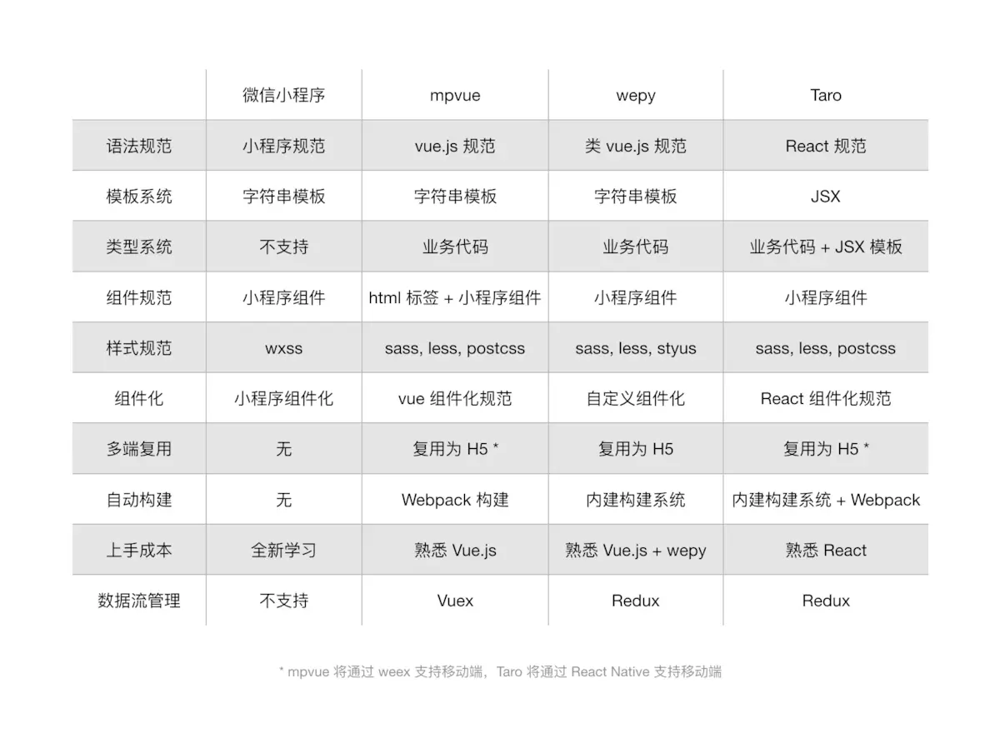
---

## 总结
### 功能
* __企业展示的小程序比较简单,功能单一,适合我们入手,我认为我们有能力完成企业展示所需要的功能;__
* __电商功能可深可浅,目前对电商功能之间的依赖性比较高,安全,稳定要求也高,我觉得需要时间去完整的梳理电商项目的逻辑,现在开发难度会很大;__
* __餐饮项目功能,结构比较清晰,在熟悉小程序开发之后,我认为上手风险不大__

### 技术
* __github上面有很多开源项目,我们可以拿来学习.__
* __部分框架能够实现,一套代码,多端部署.我们开发的小程序也将可以在页面,移动端部署__

### 前景
* __如果平台能够接入足够多的小程序,小程序的数据保存在我们的云上面,这些数据将会是重要的信息资源.以后也许可以利用这些信息资源,开发出优秀的,综合的产品.__

---
[小程序设计指南]: https://developers.weixin.qq.com/miniprogram/design/
[小程序资料]: https://github.com/justjavac/awesome-wechat-weapp
[taro]: https://github.com/NervJS/taro
[wepy]: https://github.com/Tencent/wepy
[mpvue]: https://github.com/Meituan-Dianping/mpvue
